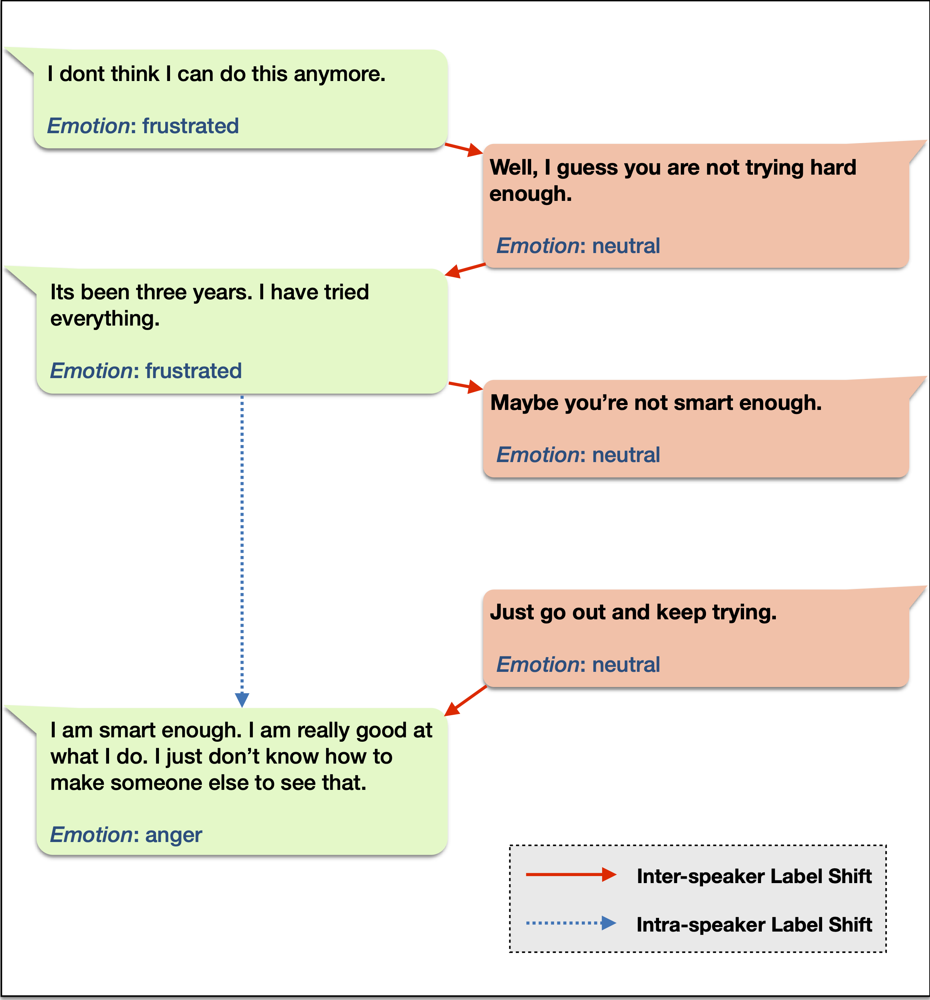
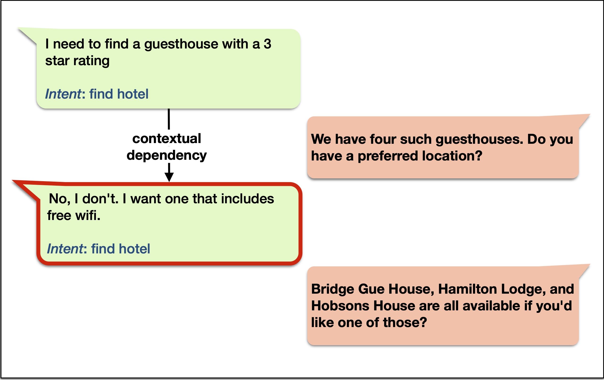
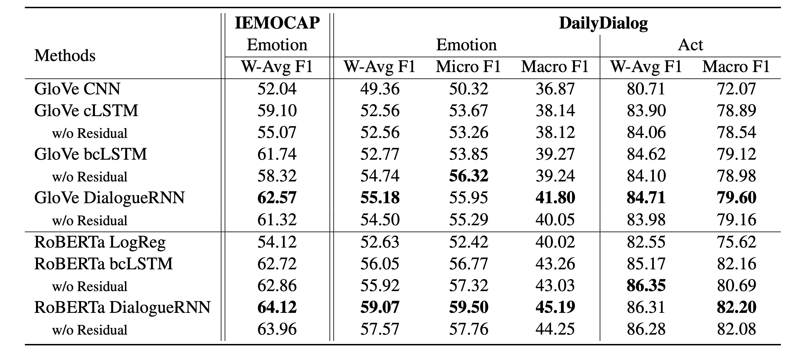
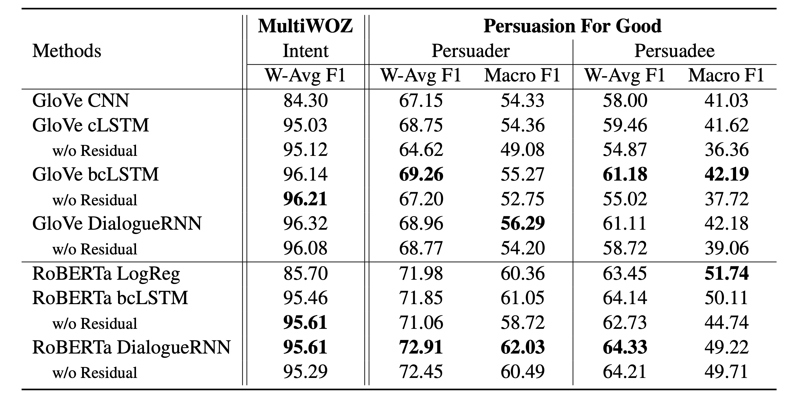

# Utterance-level Dialogue Understanding

This repository contains pytorch implementations of the models from the paper [Utterance-level Dialogue Understanding: An Empirical Study](https://arxiv.org/pdf/2009.13902.pdf), and [Exploring the Role of Context in Utterance-level Emotion, Act and Intent Classification in Conversations: An Empirical Study](https://declare-lab.net/assets/pdfs/dialogue-understanding-acl2021-findings.pdf)


## Task Definition

Given the transcript of a conversation along with speaker information of each constituent utterance, the utterance-level dialogue understanding (utterance-level dialogue understanding) task aims to identify the label of each utterance from a set of  pre-defined labels that can be either a set of emotions, dialogue acts, intents etc. The figures above and below illustrate such conversations between two people, where each utterance is labeled by the underlying emotion and intent. Formally, given the input sequence of N number of utterances [(u<sub>1</sub>, p<sub>1</sub>), (u<sub>2</sub>,p<sub>2</sub>),...., (u<sub>N</sub>,p<sub>N</sub>)], where each utterance u<sub>i</sub>=[u<sub>i,1</sub>,u<sub>i,2</sub>,.....,u<sub>i,T</sub>] consists of T words u<sub>i,j</sub> and spoken by party p<sub>i</sub>, the task is to predict the label e<sub>i</sub> of each utterance u<sub>i</sub>. In this process, the classifier can also make use of the conversational context. There are also cases where not all the utterances in a dialogue have corresponding labels. 

Emotion           |  Intent
:-------------------------:|:-------------------------:
  |  
  |  

## Data Format

The models are all trained in an end-to-end fashion. The utterances, labels, loss masks, and speaker-specific information are thus read directly from tab separated text files. All data files follow the common format:

Utterances: Each line contains tab separated dialogue id and the utterances of the dialogue.
```
train_1    How do you like the pizza here?    Perfect. It really hits the spot.
train_2    Do you have any trains into Cambridge today?    There are many trains, when would you like to depart?    I would like to leave from Kings Lynn after 9:30.
```

Lables: Each line contains tab separated dialogue id and the encoded emotion/intent/act/strategy labels of the dialogue.
```
train_1    0    1
train_2    2    0    2
```

Loss masks: Each line contains tab separated dialogue id and the loss mask information of the utterances of the dialogue. For contextual models, the whole sequence of utterance is passed as input, but utterances having loss mask of 0 are not considered for the calculation of loss and the calcualtion of classification metrics. This is required for tasks where we want to use the full contextual information as input, but don't want to classify a subset of utterances in the output. For example, in MultiWOZ intent classification, we pass the full dialogue sequence as input but don't classify the utterances coming from the system side.
```
train_1    1    1
train_2    1    0    1
```

Speakers: Each line contains tab separated dialogue id and the speakers of the dialogue.
```
train_1    0    1
train_2    0    1    0
```

## Datasets

The original datasets can be found in the `glove-end-to-end/datasets/_original` and `roberta-end-to-end/datasets/_original` directories.
The following datasets are included in this project:

```
 IEMOCAP (Emotion Recognition in Conversations)
 DailyDialog (Emotion Recognition in Conversations)
 DailyDialog (Act Classification)
 MultiWOZ (Intent Recognition)
 Persuasion for Good (Persuader's act classification)
 Persuasion for Good (Persuadee's act classification)
```

### Utterance-level minibatch vs Dialogue-level minibatch

The original datasets are experimented using two distinct minibatch formation techniques. They can be found in these directories `glove-end-to-end/datasets/dialogue_level_minibatch`, `glove-end-to-end/datasets/utterance_level_minibatch`, and `roberta-end-to-end/datasets/dialogue_level_minibatch`. Please refer to the paper for more information.

`glove-end-to-end/datasets/dialogue_level_minibatch` : This folder contains the dataset that can be used to prepare minibatches where **all** the utterances in the context having a valid label are classified.

`glove-end-to-end/datasets/utterance_level_minibatch` : This folder contains the dataset that can be used to prepare minibatches where **only one** utterance in the context is classified and rest of the utterances are used as context.


### Context Perturbations of the Original Data

Along with the original datasets above, we also provide different variations of these datasets with context perturbations such as style transfer, paraphrasing, label augmentation, etc. Readers can find context perturbed versions of the original datasets in the following folders and refer to the paper to find relevant information.

```
glove-end-to-end/datasets/inter_speaker
glove-end-to-end/datasets/label_augmentation
glove-end-to-end/datasets/paraphrase_attack
glove-end-to-end/datasets/spelling_attack
glove-end-to-end/datasets/style_transfer
```

## Models

We provide implementations for end-to-end without context classifier, bcLSTM and DialogueRNN models. For bcLSTM and DialogueRNN, we also provide training argument which lets you specify whether to use residual connections or not.

### RoBERTa Based Models
Navigate to `roberta-end-to-end`. We also provide training arguments with which you can alternately use BERT or Sentence Transformers models as feature extractors.

### GloVe Based Models
Navigate to `glove-end-to-end`. We have also released scripts with which you can run different analysis experiments that we report in the paper.


<!--  -->
<!--  -->
<!--  -->


### Execution
Once navigate to `roberta-end-to-end` or `glove-end-to-end` directories to use RoBERTa or GloVe based feature extractors for the models, run the following commands to execute different models explained in the paper. Note that some of the models present in the `glove-end-to-end` folder are not available in the `roberta-end-to-end` folder. However, it should not be difficult to adapt these models to use RoBERTa embeddings.

#### Main Model (Dialogue-Level Minibatch)
To train and evaluate the without context classifier model and the bcLSTM/DialogueRNN model with full context and residual connections:

`python train.py --dataset [iemocap|dailydialog|multiwoz|persuasion] --classify [emotion|act|intent|er|ee] --cls-model [logreg|lstm|dialogrnn] --residual`

The `--cls-model logreg` corresponds to the without context classifier.

#### Main Model (Utterance-level Minibatch)

`python train_utt_level.py --dataset [iemocap|dailydialog|multiwoz|persuasion] --classify [emotion|act|intent|er|ee] --cls-model [logreg|lstm|dialogrnn] --residual`

#### Speaker Level Models
`w/o inter` : Trained at dialogue-level minibatch. To train and evaluate bcLSTM model in this setting i.e. only with context from the same speaker:

`python train_intra_speaker.py --dataset [iemocap|dailydialog|multiwoz|persuasion] --classify [emotion|act|intent|er|ee] --residual`

`w/o intra` : Trained at utterance-level minibatch. To train and evaluate bcLSTM model in this setting i.e. only with context from the other speaker:

`python train_inter_speaker.py --dataset [iemocap|dailydialog|multiwoz|persuasion] --classify [emotion|act|intent|er|ee] --residual`

#### Shuffled Context and Shuffled Context with Order Prediction Models
Trained at dialogue-level minibatch. To train and evaluate bcLSTM model with various shuffling strategies in train, val, test:

`python train_shuffled_context.py --dataset [iemocap|dailydialog|multiwoz|persuasion] --classify [emotion|act|intent|er|ee] --residual --shuffle [0|1|2]`

`--shuffle 0` : Shuffled context in train, val, test.

`--shuffle 1` : Shuffled context in train, val; original context in test.

`--shuffle 2` : Original context in train, val; shuffled context in test.

#### Context Control Models
Trained at utterance-level minibatch. The script is `train_context_control.py`. You can specify training arguments to determine how to control the context.

## Baseline Results




### Note

If you are running GloVe-based end-to-end models, please run the scripts multiple times and average the test scores of those runs.

## Citation
`Utterance-level Dialogue Understanding: An Empirical Study. Deepanway Ghosal, Navonil Majumder, Rada Mihalcea, Soujanya Poria. arXiv preprint
arXiv:2009.13902 (2020).`

`Exploring the Role of Context in Utterance-level Emotion, Act and IntentClassification in Conversations: An Empirical Study. Deepanway Ghosal, Navonil Majumder, Rada Mihalcea, Soujanya Poria. Findings of ACL (2021).`
